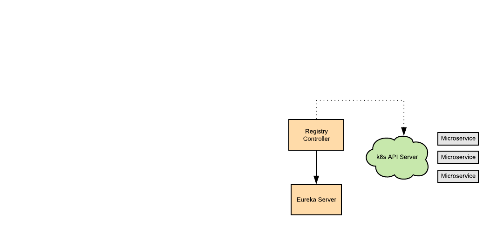

# Spring Cloud Service Registry Controller

A Kubernetes controller implementation using Fabric8 Java-Client as a proxy
to register kubernetes services' endpoints with a Eureka Server. 



A service needs to be labeled with `cloud.spring.io/enabled: "true"` to be picked 
up and with `cloud.spring.io/register: "true"` to enable it to register.

### Installation

```bash
### install the controller and a Eureka server
$ kubectl create -f ./deploy/manifest_kubernetes.yaml

### To access the Eureka server check the exposed services IP:port in your cluster
$ kubectl get services

### create the provided sample service and note that it's registered with Eureka
$ kubectl create -f ./sample/examle.yaml
```

#### Trying it locally using Minikube

If you are running a local Minikube, you would need
to change the Eureka service in the manifest to be of "NodePort" type (and the example also).
And to find out a service URL in Minikube use ``` minikube service eureka-server --url```

#### Trying it in Google Cloud Platform

Provided you have a GCP account, `gcloud` cli installed, and authenticated `(using: gcloud auth login)`.

```sbtshell
### create a cluster
$ gcloud container clusters create mycluster --cluster-version=latest --zone us-central1-a

### set gcloud config with default cluster
$ gcloud config set container/cluster mycluster

### get k8s credentials
$ gcloud container clusters get-credentials mycluster --zone us-central1-a

### Check you can access the cluster
$ kubectl cluster-info

### install the registry proxy controller and a eureka server
$ kubectl create -f ./deploy/manifest_kubernetes.yaml

### note the external IP of the eureka server
$ kubectl get services

### run the example and check if the service is registered with eureka
$ kubectl create -f ./sample/examle.yaml

### clean up
$ gcloud container clusters delete mycluster

```